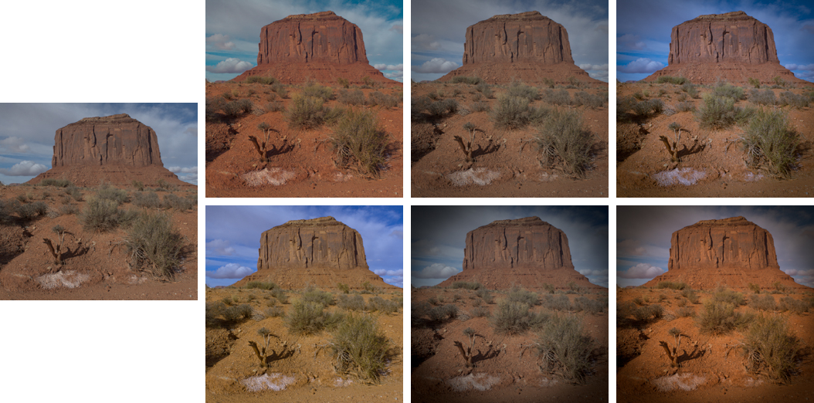
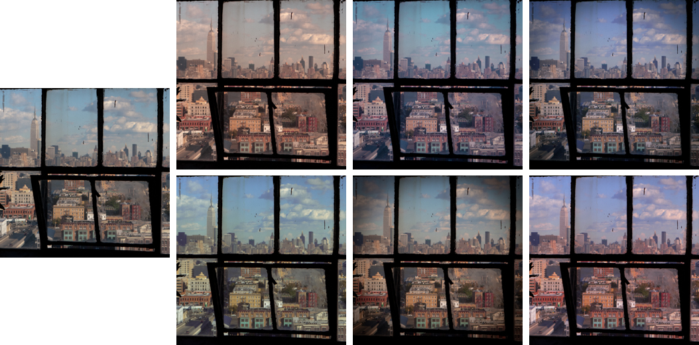
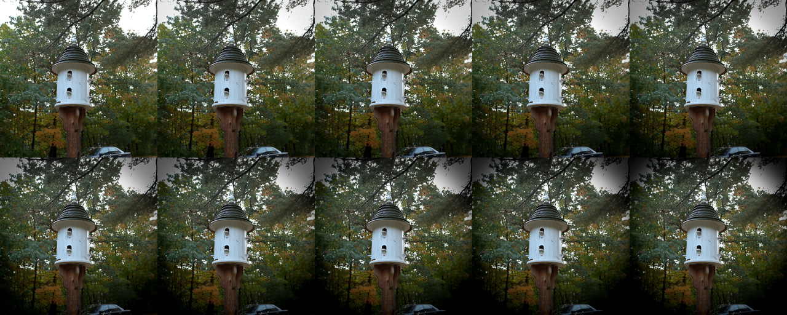

# An Investigation Into Reverting Image Enhancements Using Deep Learning

As part of my individual project, I decided to tackle the issue of reverting image enhancements with the use of a Generative Adversarial Network (GAN) as my approach.


## Setup
### Pre-requisites
- Tensorflow 1.4.1

### Recommended
- Linux with Tensorflow GPU edition + cuDNN

### Getting Started
```bash
# Clone this repository:
git clone git@github.com:fjmillman/image-reversion.git
 
# Change directory into the repository
cd image-reversion
 
# Download the datasets
bash download-datasets.sh
 
# Train the model
python main.py --input_dir datasets/{dataset}/train
    --output_dir datasets/{dataset} --mode train
 
# Test the model
python main.py --input_dir datasets/{dataset}/test
    --output_dir datasets/{dataset}/results --mode test
    --checkpoint datasets/{dataset}
```

### Testing the outputs
The outputs of testing can be compared to see whether the model has successfully managed to revert the image enhancements. Two different operations can be run to find the image similarity metric averages of the dataset or to get a sum of absolute difference heatmap between each pair of images.

Replace operation with 'metrics' or 'heatmap'
```bash
python test.py --image_dir_a datasets/{dataset}/results/targets
    --image_dir_b datasets/{dataset}/results/outputs
    --output_dir datasets/{dataset}/results --operation {operation}
```

## The Dataset

I generated a supervised dataset of image pairs using the [MIT-Adobe FiveK](https://data.csail.mit.edu/graphics/fivek/) dataset created by [Bychkovsky et al.](http://people.csail.mit.edu/vladb/photoadjust/). It consisted of a set of 100 image pairs divided into the same 75 training image pairs and 25 testing image pairs for 6 different datasets. Each dataset represents a variation of image enhancements applied to an image with two colour enhancements, two vignette enhancements, and two combining the two enhancements together.



These 6 datasets were also combined into one superset for the purpose of training the model on all of the datasets at once to explore how the GAN could handle this.

I also generated an additional sub-dataset consisting of 6 different variations of colour enhancements and vignette enhancements applied to 10 different images which would be used to explore the GAN's ability to handle these variations.



The dataset can be downloaded [here](https://drive.google.com/open?id=1fQGpMnarbwaZD1I-4Af-DYbm2bz8vfQ8).

## The Vignette Dataset

As part of my investigation, I discovered a limitation of the GAN in its ability to handle the removal of a deeper depth of vignette. I generated a dataset that could be used to explore this limitation consisting of the same 100 image pairs split into 75 training image pairs and 25 testing image pairs for 10 different datasets each with an incrementing depth of vignette.



The vignette dataset can be downloaded [here](https://drive.google.com/open?id=1HyV3JdNVMblKW9AYLe_xDwfZlIREPk7T).

## Acknowledgements
This implementation is based on a port of [pix2pix](https://github.com/phillipi/pix2pix) from PyTorch to Tensorflow which was written by [affinelayer](https://github.com/affinelayer/pix2pix-tensorflow). 
